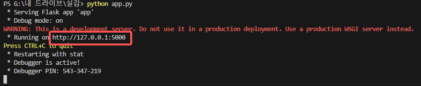

<p align="center">
  
</p>


</p>
</p>
<h1 align="middle">AIHC</h1>
<h3 align="middle">AI를 활용한 건강 챗봇</h3>

<br/>

## Project Overview
- AI가 해당 증상에 맞는 응급처치 방법을 사용자에게 빠르고 효율적으로 응급 정보를 제공. 
- 적절한 병원(일반 내과, 정형외과 등)을 추천


---
## Main Features
- [x] 챗봇을 통해 증상분석을 하고, 병원 추천 및 조회
- [x] 지역별, 진료과목별 병원 조회
- [x] 자신이 복용하는 약의 정보를 검색

---

## 🖼️ Screenshot
 

---
## 🛠️ Stack
- **IDE:** Google Colab, VSCode  
- **Frontend:** HTML, CSS  
- **Backend:** Flask, Node.js, Python  
- **Library:** OpenAI, Requests, xml.etree.ElementTree  
- **API:**  
  - [식품의약품안전처_의약품개요정보(e약은요)](https://www.data.go.kr/tcs/dss/selectApiDataDetailView.do?publicDataPk=15075057)  
  - [국립중앙의료원_전국 병·의원 찾기 서비스](https://www.data.go.kr/tcs/dss/selectApiDataDetailView.do?publicDataPk=15000736)  
  - [국립중앙의료원_코드마스터 정보 조회 서비스](https://www.data.go.kr/tcs/dss/selectApiDataDetailView.do?publicDataPk=15000445)  

---

## 🚀 설치 및 실행 방법

1. **Python 설치**
   이 프로젝트를 실행하려면 Python 3.9 이상이 필요합니다.  
   [Python 공식 웹사이트](https://www.python.org/downloads/)에서 Python을 다운로드하고 설치하세요.  
   설치 중에 **"Add Python to PATH"** 옵션을 반드시 선택하세요.


2. **OpenAI 및 Flask 설치**  
   VSCode의 터미널(또는 명령 프롬프트)을 열고 다음 명령어를 실행합니다:
   ```bash
   pip install openai==0.28
   pip install flask


3. **프로젝트 실행**
   프로젝트 디렉토리로 이동한 다음에 프로젝트를 실행합니다.
   ```bash
   python app.py
   ```

    
   사진과 같이 주소가 나오면 ctrl + 클릭 을 해서 웹페이지로 이동합니다.


4. **챗봇을 통해 병원 추천 받기** 
   메인화면에서 스크롤을 내리면  
    
   입력칸에서 대화를 시작하고 챗봇이 증상을 분석한 후 병원을 추천 받을지 여부를 묻습니다.
   바로 병원추천 받는 페이지로 이동하려면 "예"를 입력합니다.
   Ex. 
    


